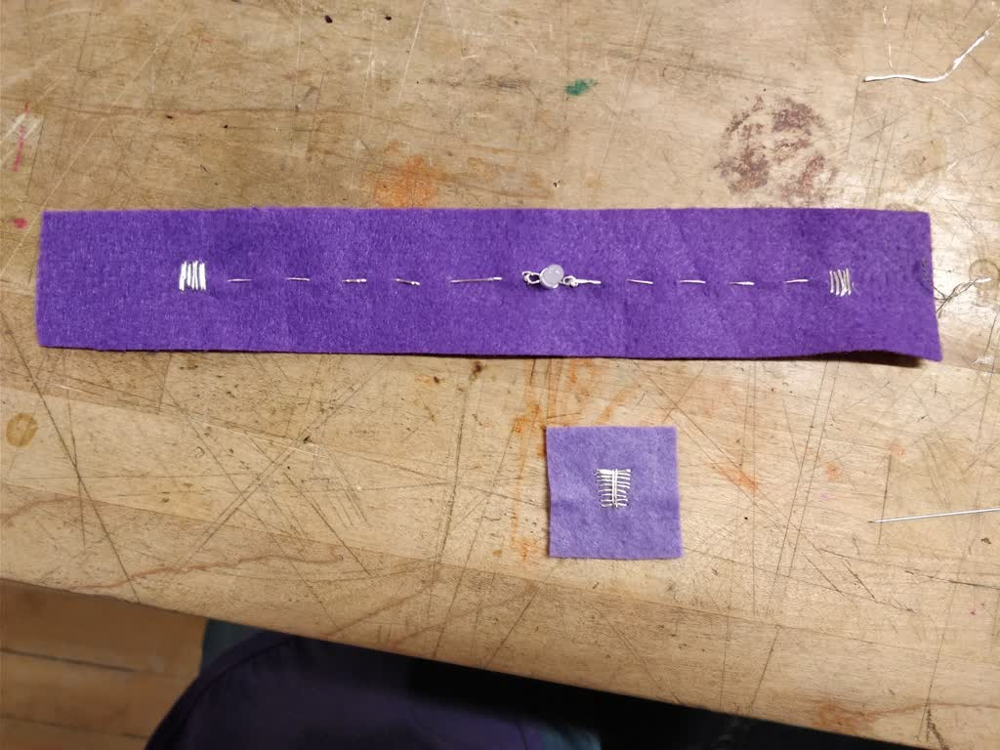

# "light" accessory

On your wrist, easy on - easy light. A bracelet that can illuminate a keyhole or show how cool your dance moves are. And also my first soft circuit assignment for this class.

<!-- VIDEO -->

## Stabbing and stabbing = sewing

I never thought sewing would be a skill I'd learn at grad school. It's not like I don't know how to, but I haven't done that in a long time and I'm not the best at it. Thankfully, I'm getting better at it pretty quickly. In part, because I had to do the soft circuit (a circuit made from textiles) three times. Why? Well, the first LED broke. And later...

**Silver-based conductive thread**. It is beautiful, shines wonderfully, BUT it oxidizes and loses all conductive properties. Of course, I didn't recall that and did not test it before getting all the circuit done. So when it didn't work out, and the LED was fine (and put in the correct direction), and the battery was charged, I realized the problem. At least I took a pretty photo of it before undoing it.

## Making a switch

The assignment required us to have a switch on the soft creation. I figured that this accessory required an "always-on" approach, but only when it was on. Otherwise, it would be a waste of battery and removing the battery does not really count as a switch. So I designed the circuit in such a way that it only closes whenever you have it on. To this end, I added a velcro patch that aligns the conductive thread perfectly with each part in order to close the circuit.

Here, you can see both front and back of the accessory:

