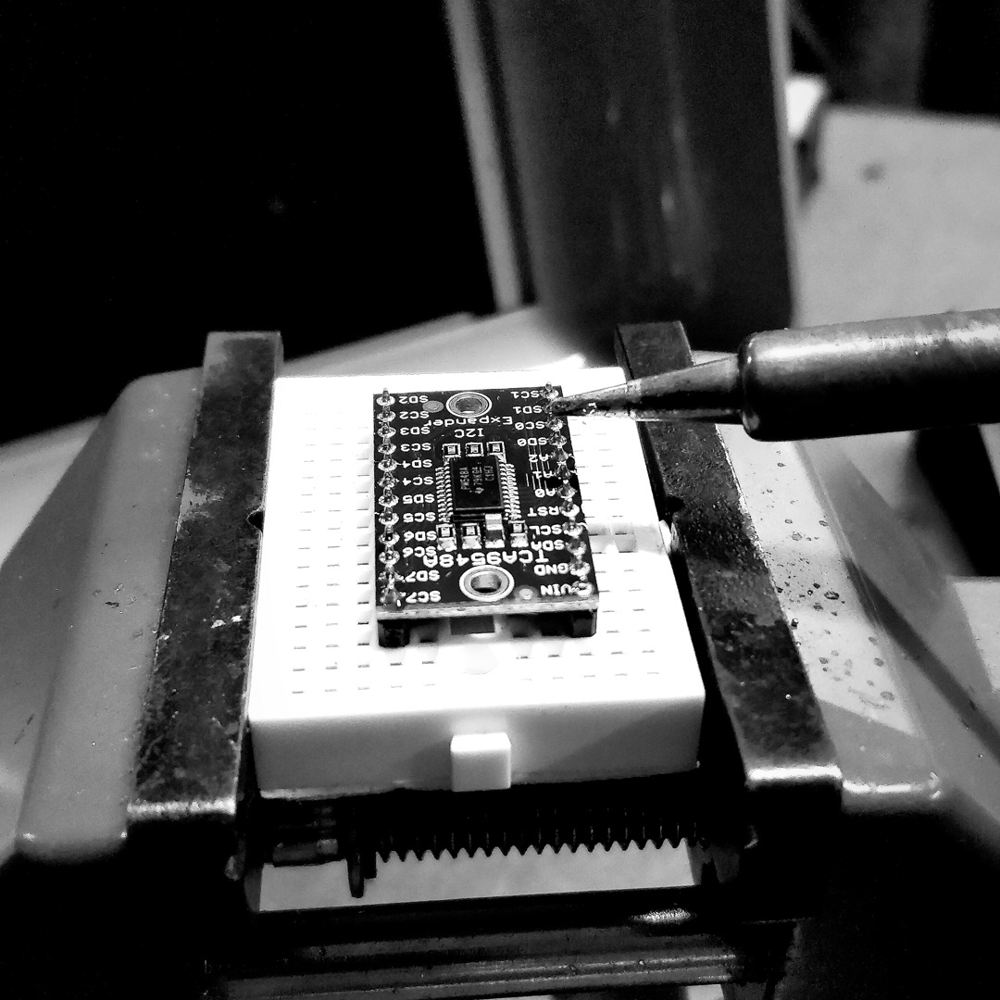
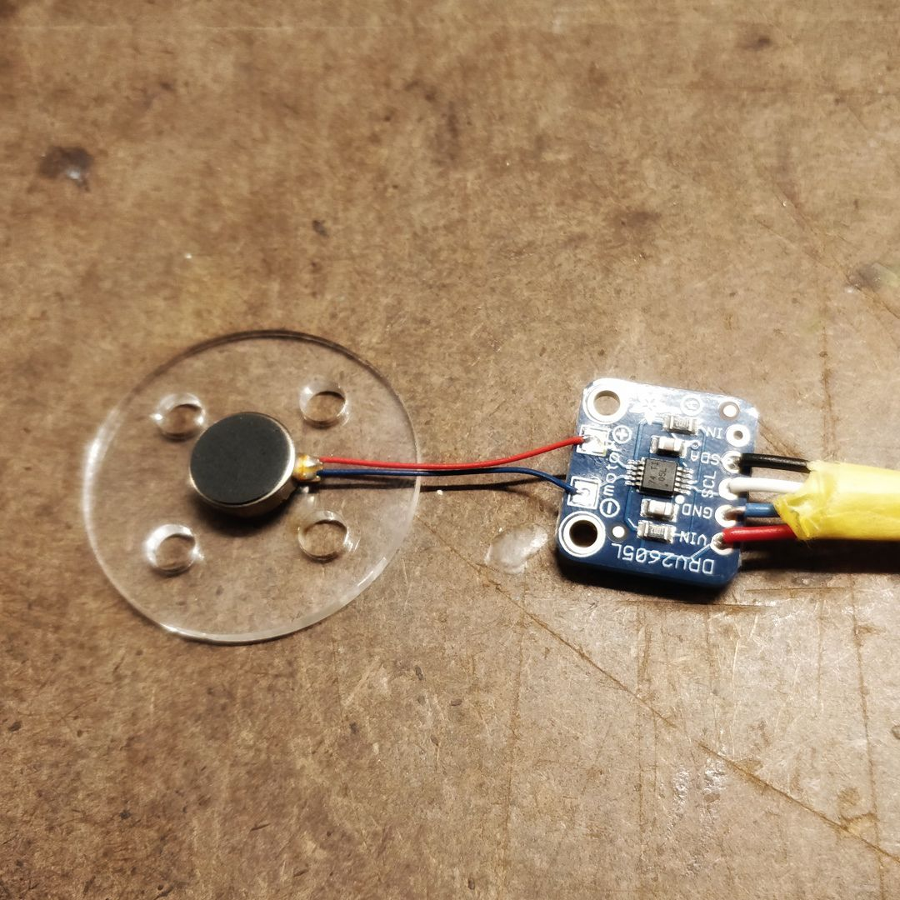
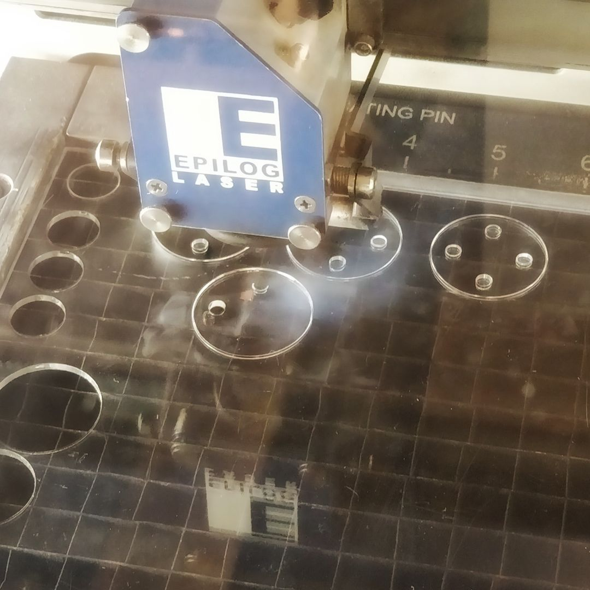
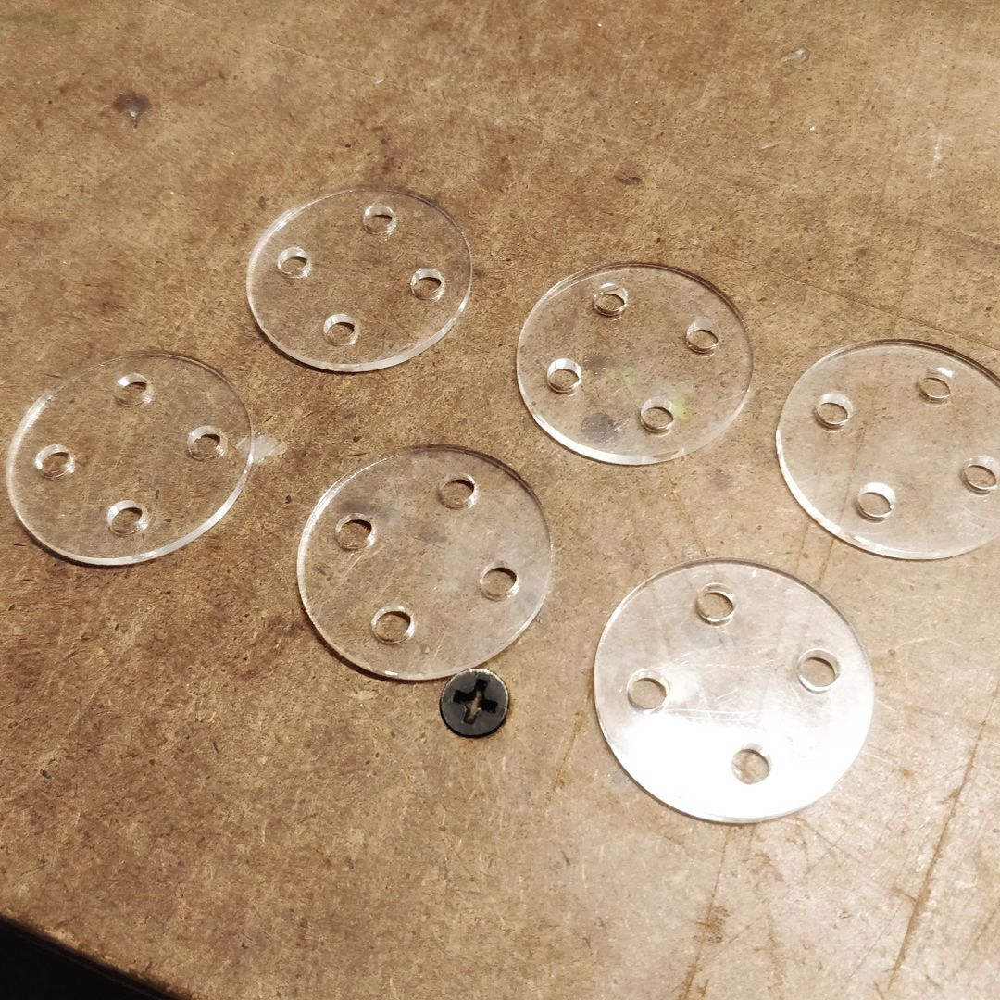

# Rhythm on my (synthetic) skin

Being a one-person band is (very) fun, and also anxiety inducing. There are many things to keep track of, specially if you have many layers/instruments playing with you (from the computer). It's not only about how it sounds, we do have that feedback, but if things are working and how they are working is something that might be out of our reach while we are performing. At the same time, the auditive feedback of what we're playing is not always the best. The performer can get distracted or lost by the result of their live exploration.
<!-- I think this is because we're focused on making sound, so trying to get information out of that -->

As a way to dig through the information and get more interesting possibilities of feedback, I want to create a jacket that transmits specific data from a Max patch in a live performance via 6 vibration motors. These motors would be arranged in a certain pattern in the back and some of the possible functionalities are:
- metronome
- instrument gain level
- instrument behavior output (i.e: waveform)
- data about next or previous element in a generative model

## Components
The jacket itself will be a denim jacket/shirt (I've already used it before for a [wearable project](http://itp.nicolaspe.com/2017/09/physical-is-wearable/)), so the things I have to figure out are the electrical components. These can be broken down on jacket electronics, and communication elements + micro-controller.

#### Jacket electronics
The main part of the jacket is the vibration motor arrangement. It is what will feed me information about the live performance:
- [Vibrating mini motor disk](https://www.adafruit.com/product/1201), very small and effective vibration motors, special for haptic feedback wearables.
  - An alternative would be [LilyPad's Vibe Board](https://www.sparkfun.com/products/11008), which comes in a nicer and easier to use presentation for wearables. But due to the volume of motors I'll use and considering the next item I'll also need, I'll just create my own platform for the motors.
- [DRV2605L Haptic Motor controller](https://www.adafruit.com/product/2305) to have better control over the motor and get a richer expressiveness potential. This will be key in the expressiveness of the device.
- [TCA9548A I2C Multiplexer](https://www.adafruit.com/product/2717) to be able to address each of the motor controllers, as they are not addressable individually.

Apart form this, I can use some extra elements to add to my wearable device in a future (if they make sense):
- NeoPixels (maybe, [sewable ones?](https://www.adafruit.com/product/1260)), because it'd be just fabulous. And it can be used with different materials to create cool diffusion or reflections.
  - Mylar
  - Silver reflective iron-on material
- [Small Microphone](https://www.adafruit.com/product/1713) near my neck to record/playback my voice.
- 9-DOF Accelerometer + Gyroscope + Magnetometer ([sewable](https://www.adafruit.com/product/2020) or [board](https://www.adafruit.com/product/3463)) for different parameters.

#### Micro-controller & communication elements
The micro-controller is highly dependent on the communication method I use. This is a critical issue. I can go many routes and each has different advantages and disadvantages.

If I go with wired MIDI (over USB) connections, I can easily use a [Teensy 3.6](https://www.pjrc.com/store/teensy36.html), which features built-in MIDI communication. This can also be used to easily send messages back to the computer and control or trigger different parameters.

Otherwise, I can use a [Flora](https://www.adafruit.com/product/659), as it has many existing and easy to use modules for wireless communication, such as the [Bluetooth LE module](https://www.adafruit.com/product/2487). Sadly, Bluetooth does not have a reliable speed and the latency issue would ruin any music based project. There are also some RF transciever modules, like the [RFm69HW](https://www.digikey.com/products/en?mpart=COM-13910&v=1568) is a good way to send a lot of data between the computer and the wearable device.

The main factor is the latency. Through my research I reached [this paper](https://www.eecs.qmul.ac.uk/~andrewm/mcpherson_nime2016.pdf) where they found that the maximum allowed latency for a beat is around 10ms, which is needed for the metronome. I have used XBee modules before, but the [XBee latency](http://hades.mech.northwestern.edu/index.php/PIC32MX:_XBee_Wireless_Round-trip_Latency) is just too high. Same with Bluetooth and even some RF modules. I will try to make it wireless, but only after getting it done over cable.

## Preparing the electronics

I got the electronic components and I need to prepare them for use. Besides soldering, one important decision lies on whether to solder pins to them or not. The microcontroller will be mounted on a [Perma-Proto Breadboard](https://www.adafruit.com/product/1609) which lets me keep the pins I had already soldered on the Teensy and prototype in an easier fashion. This is also useful for the I2C Multiplexer, as it can be far from the components it controls. However, the motor drivers cannot have pins, as these components need to be as thin as possible to make the jacket comfortable to wear. I decided to use wire on one of the motor drivers in order to begin the tests and that will be used or resoldered with silicon stranded wire in the end.

Finally, I created some disks for the vibration motors. If these motors are placed directly on fabric, their vibration power gets diminished. But this can be solved by placing them on a rigid surface and mount that on the fabrics. I used 2mm acrylic and added four holes to make it easy to sew them on the fabric.

