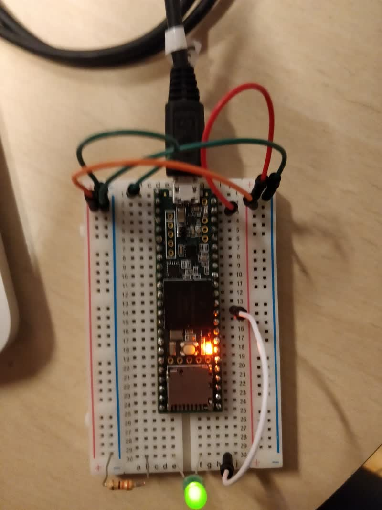
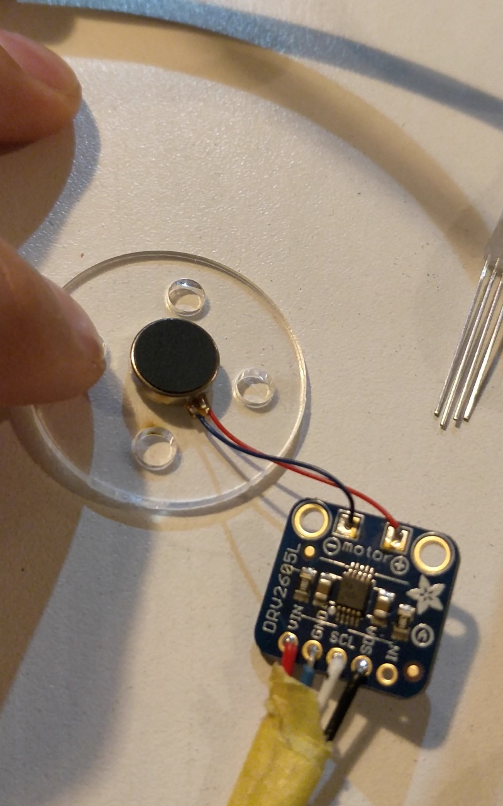
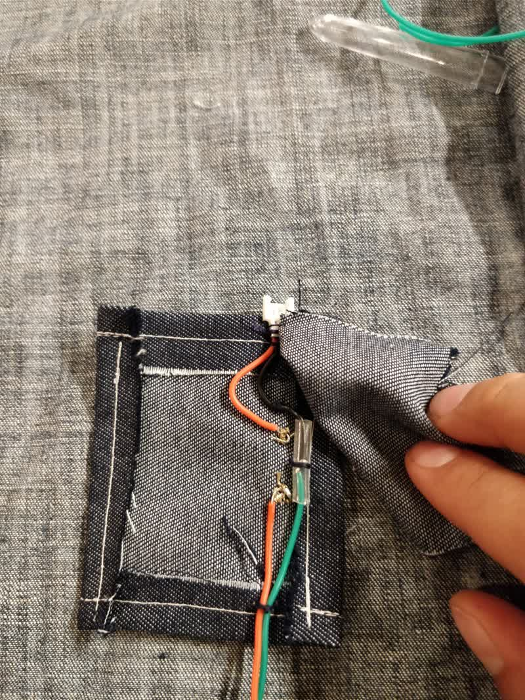
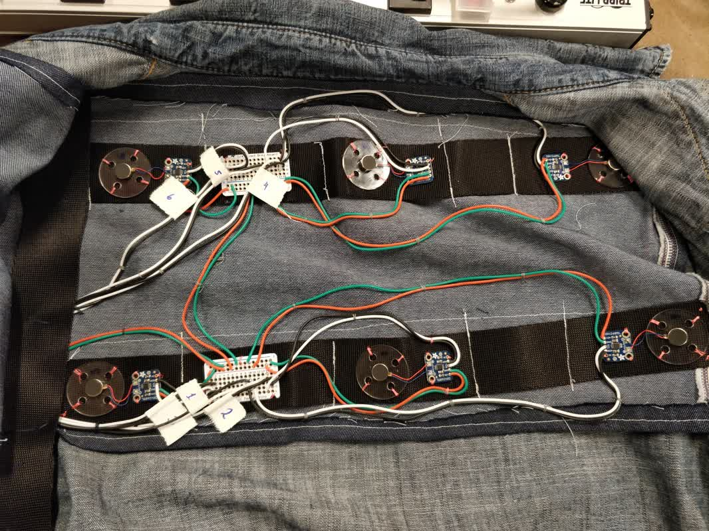

# Rhythmic skin

Rhythmic skin is a wearable device for one-person musical performances. Aiming to solve the issue of auditive overload and relieve pressure from the performer, this device sends haptic messages to the back of the user, transmitting only key information about the computerized part of the performance. Moreover, the rhythmic driver can be added-on any existing jacket, only by adding three velcro zones to the interior of the garment.

## Underlying technology
The Rhythmic skin relies on a Teensy 3.6 micro-controller. With the native ability to transmit MIDI messages over USB, it provides instant communication with any music software. It uses this protocol to send the metronome beats, as well as receive data about up to 5 different layers of instruments.

To transmit the messages, it relies on a simple vibration motor driven by a DRV2605, which provides up to 117 different patterns. This provides enough variation to send unique and detectable messages. They are coupled with an I2C Multiplexer to manage the signals to each haptic motor driver.

The code for the driver and the accompanying performance can be found on the [GitHub repository](https://github.com/nicolaspe/itp_fashion/tree/master/rhythm_wear/teensy_files).

## Issues
Sadly, the Teensy 3.6 cannot handle currents high enough to power the six vibration motors. At the same time, they can handle up to 5 volts, which means that under the 3.3V that the Teensy provide, their signal is not strong enough. To solve this problem, I added a battery pocket holder, which adds the much needed power to function properly.

Another issue lies with the placement of the vibration motors, which can be further improved. The lower back row needs to be adjusted, as the location shifts while performing and it is something to take into account. Additionally, the webbing used to place place and secure them proved to be rigid enough to transmit the vibrations form one end to the other. While the added vibrating surface is a plus, they will need to be isolated in order not to mix up the haptic messages.

